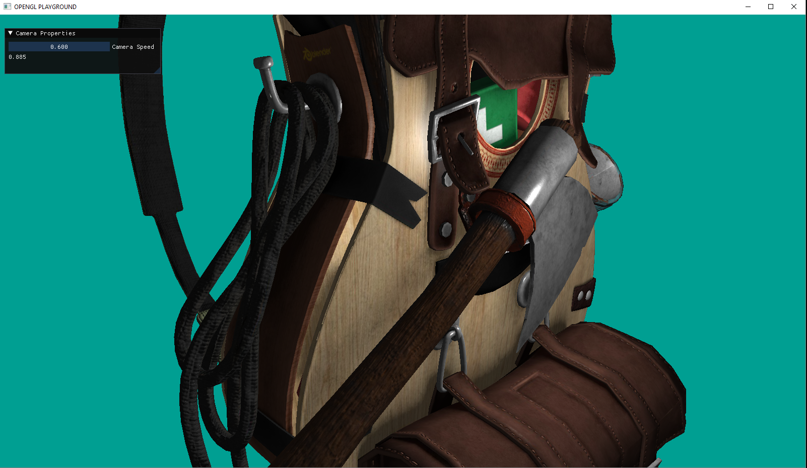

# OpenGL Playground
OpenGL Playground repository for tracking my progress in learning OpenGL.

## COMPILATION: BUILD PROJECT FOR VS 2019
    rm -rf <build_folder>
    mkdir <build_folder>
    cmake -G "Visual Stuido 16" -S . -B <build_folder>
    cmake --build <build_folder>

### Import Assimp Lib
* compile assimp-5.0.1 according to instructions in BUILD.md file.
* add a new folder into project's dependencies folder and name it as assimp-5.0.1.
* copy assimp-vc142-mtd.dll and assimp-vc142-mtd.lib from compiled assimp to the new assimp-5.0.1 folder.
* copy include folder of assimp to the new assimp-5.0.1 folder.
* copy include folder to the build_folder/dependencies/assimp-5.0.1 path(if there is no assimp-5.0.1 folder here, create it)
* copy assimp-vc142-mtd.dll to the same path with the project's exe.
* open Visual Studio, Solution Explorer->OpenGL-Playground(right click)->properties->linker->input->additional dependencies(edit)->
  add assimp-vc142-mtd.lib path that is project's dependencies folder (..\..\Dependencies\assimp-5.0.1\assimp-vc142-mtd.lib)
* open Visual Studio, Solution Explorer->OpenGL-Playground(right click)->properties->C/C++->General-> additional include directories->
  add include folder path that is in build_folder. (C:\OpenGL-workingArea\build\Dependencies\assimp-5.0.1\include)

## TEASER: few examples I made with OpenGL

In this section, I prepared a series of rendered images from my OpenGL journey.

- **Hello triangle!**
Triangle is drawn in Normalized Device Coordinates.

- **Textures and Basic Lighting**
Indexed drawing is implemented to draw a quad with a texture on it. Basic lighting 
calculations are applied according to a given point light position in fragment shader.

- **Random Squares**
Colored squares are drawn using indexed drawing with a point light. The model matrices of 
squares are generated from random scale, rotate and translate values. Color codes are also 
random uniform values.

- **3D transformations**
3D cube objects are drawn and they are translated using random model matrices. The scene 
is rendered from the camera’s point of view and perspective projection is impelemented.

- **3D Terrain using height map texture**
  Height map represents the elevation values of the terrain. The terrain is drawn on grids and it 
  is colored according to this elevation value.

hegiht map texture              | terrain
:------------------------------:|:--------------------------------:
  | 

- **Clouds from noise texture**
  Dark parts of the noise texture is discarded to draw a cloud-like image.

- **Framebuffer**
  The scene is drawn from a different perspective on the framebuffer by changing the view matrix. 
  It is shown in the upper left corner.

- **3D grassland from a single grass texture**
Two grass textures are drawn on the same center, at 90 degrees angle to each other on the z-axis. This 
structure is scratched enough to cover the whole floor. Therefore, a grassland image is obtained.

single grass texture         | 3D grassland
:---------------------------:|:-------------------------------:
 | 

- **Blending**
Transparency is implemented according to 0.5 alpha value within window object.

- **Interface**
  Interfaces resembling game screens are drawn using orthographic projection. No external GUI application
 is used.

Names          | Screen Images                                
:-------------:|:--------------------------------------------------:
Main Menu      | 
Credits        | 
Pause          | 

- **Button Click Effect**
  When the buttons are clicked, a texture with no text on it and lighting applied in the middle 
  is drawn.

Button Click                                      | Button Click                                
:------------------------------------------------:|:---------------------------------------------:
         |  
     |  

- **Generate Random Map**

A 3-channel map texture(bmp) is created using GIMP. Each unique pixel color corresponds to an entity 
like a wall or a cube. The map texture's pixel color and coordinates are read and translate values are 
calculated according to pixel coords. Cube models are translated to these translate values.
With this method, a random map can be generated using any colored bmp. 

Map is drawn to a quad. This quad vertices are set in vertex shader, not in CPU.

Colored bmp file            | Map 
:--------------------------:|:-------------------------------------------------------:
 | 

- **Directional Light**
Directional light calculations are impelemented in fragment shader for the whole scene. 
Ambient, specular and diffuse lighting components are combined.

- **Depth Test**
A value in the depth buffer corresponds to the depth of a fragment clamped to [0,1] from the 
camera’s point of view.

- **Model Loading with Assimp**
Sponza model is loaded using Assimp library. Tangent space calculations are also added into Assimp 
for further applications.

- **Depth Map**
 The scene is rendered from the light’s perspective and the resulting depth values are stored in a texture
 called depth map. A framebuffer object is created for rendering the depth map.

- **Normal Mapping**
Tangent space is calculated for the model and it is used as the new coordinate system. A brick surface is 
quite rough surface and obviously not completely flat. Therefore, the surface has not only one directional 
normal vectors, it has a different directional normal vector per fragment. 

Normal mapping for backpack                       |
:------------------------------------------------:|
 |
 

- **Shadow Mapping**
Shadow of backpack model is drawn. First, depth values are drawn to the FBO depthMap texture. It is shown in the 
left top corner of the window in screen space. Then the scene is drawn two times. The first time, the scene is 
drawn from the light's view and the second time, it is drawn from the camera's point of view.

- **Cube Map**
A combination of multiple textures mapped into one to create a cube map.

- **Anti Aliasing**
Anti Aliasing is applied using MSAA. The difference can be seen in the plane model.

Before                                                    |
:--------------------------------------------------------:|
 |
**After**                                                 |
   |

